# Rotator - Namespace-Aware Log Rotation (Go + Helm)

Per-node DaemonSet for rotating logs under `/pang/logs/<namespace>/<pod>/**` with configurable defaults and namespace/path-specific overrides.

## Features

- **🔄 Smart Rotation**: Size, age, and inactivity-based rotation triggers
- **🏗️ Multiple Techniques**: Rename+create and copytruncate rotation methods  
- **📦 Compression**: Automatic gzip compression with configurable delays
- **🎯 Namespace-Aware**: Per-namespace policies and budget controls
- **📊 Observability**: Prometheus metrics, health endpoints, structured logging
- **🔒 Secure**: Non-root execution, minimal privileges, read-only filesystem
- **⚡ Production-Ready**: Helm chart with comprehensive configuration options

## Quick Start

### Prerequisites
- Kubernetes 1.19+
- Helm 3.x
- Docker (for building)

### 1-Minute Deployment
```bash
# Clone repository
git clone https://github.com/tapasyadubey/log-rotate-util.git
cd log-rotate-util

# Quick deploy (update YOUR-REGISTRY)
./quick-deploy.sh YOUR-REGISTRY/rotator v1.0.0

# Deploy demo applications  
kubectl create ns payments checkout
kubectl apply -n payments -f hack/log-writer-daemonset.yaml
kubectl apply -n checkout -f hack/log-writer-daemonset.yaml

# Monitor metrics
kubectl port-forward -n log-rotation daemonset/rotator 9102:9102
curl http://localhost:9102/metrics
```

## Architecture


## Configuration

### Basic Configuration
```yaml
rotator:
  defaults:
    policy:
      size: 100Mi           # Rotate at 100MB
      age: 24h              # Rotate daily
      keepFiles: 5          # Keep 5 rotated files
      compressAfter: 1h     # Compress after 1 hour
    budgets:
      perNamespaceBytes: 10Gi  # 10GB namespace limit
```

### Namespace Overrides
```yaml
rotator:
  overrides:
    namespaces:
      production:
        policy:
          size: 50Mi
          defaultMode: copytruncate
        budgets:
          perNamespaceBytes: 20Gi
      
      development:
        policy:
          keepFiles: 10
          keepDays: 14
```

### Path-Specific Policies
```yaml
rotator:
  overrides:
    paths:
      - match: "/pang/logs/legacy-app/**"
        policy:
          defaultMode: copytruncate
          size: 1Gi
```

## Deployment Options

### Option 1: Quick Deploy Script
```bash
./quick-deploy.sh your-registry/rotator v1.0.0
```

### Option 2: Helm Install
```bash
cd helm/rotator
helm install rotator . \
  --set rotator.image.repository=your-registry/rotator \
  --set rotator.image.tag=v1.0.0 \
  --namespace log-rotation \
  --create-namespace
```

### Option 3: Production Deploy
```bash
# Customize production-values.yaml first
helm install rotator . \
  --values production-values.yaml \
  --namespace log-rotation
```

## Monitoring

### Metrics Available
- `rotator_rotations_total{namespace,technique}` - Total rotations performed
- `rotator_bytes_rotated_total{namespace}` - Bytes rotated per namespace  
- `rotator_ns_usage_bytes{namespace}` - Current namespace usage
- `rotator_scan_cycles_total` - Health/activity metric
- `rotator_errors_total{type}` - Error counts by type

### Health Endpoints
- `GET /live` - Liveness probe
- `GET /ready` - Readiness probe  
- `GET /metrics` - Prometheus metrics

### Example Monitoring
```bash
# Port forward to access metrics
kubectl port-forward daemonset/rotator 9102:9102

# Check health
curl http://localhost:9102/live
curl http://localhost:9102/ready

# View metrics
curl http://localhost:9102/metrics | grep rotator_
```

## Security

### Production Security Features
- ✅ **Non-root execution** (user 65534)
- ✅ **Read-only filesystem** with specific writable volumes
- ✅ **Dropped capabilities** (drop ALL)
- ✅ **No privilege escalation**
- ✅ **Minimal RBAC** (no Kubernetes API access)
- ✅ **Service account token auto-mount disabled**

### Security Context
```yaml
securityContext:
  runAsNonRoot: true
  runAsUser: 65534
  runAsGroup: 65534
  fsGroup: 65534
```

## Operational Workflows

### Development
```bash
# Build and test locally
cd rotator
go test ./...
go build ./cmd/rotator

# Deploy to development
helm upgrade rotator ../helm/rotator \
  --set rotator.image.tag=dev \
  --set rotator.defaults.policy.size=32Ki  # Quick rotation for testing
```

### Production Deployment
```bash
# Build and push release image
docker build -t registry/rotator:v1.0.0 .
docker push registry/rotator:v1.0.0

# Deploy with production values
helm upgrade rotator helm/rotator \
  --values helm/rotator/production-values.yaml \
  --set rotator.image.tag=v1.0.0
```

### Monitoring Setup
```bash
# Enable ServiceMonitor for Prometheus Operator
helm upgrade rotator helm/rotator \
  --set serviceMonitor.enabled=true

# Import Grafana dashboard
# Use rotator-dashboard.json from docs/
```

## Troubleshooting

### Common Issues

**Permission Errors**
```bash
# Check file permissions
kubectl exec $(kubectl get pods -l app=rotator -o name) -- ls -la /pang/logs

# Fix permissions on nodes
kubectl apply -f - <<EOF
apiVersion: batch/v1
kind: Job
metadata:
  name: fix-permissions
spec:
  template:
    spec:
      containers:
      - name: fix
        image: alpine
        command: ["chown", "-R", "65534:65534", "/host/pang/logs"]
        volumeMounts:
        - name: logs
          mountPath: /host/pang/logs
      volumes:
      - name: logs
        hostPath: {path: /pang/logs}
      restartPolicy: Never
EOF
```

**No Rotations Happening**
```bash
# Check thresholds in config
kubectl get configmap rotator-config -o yaml

# Check file sizes
kubectl exec $(kubectl get pods -l app=rotator -o name) -- find /pang/logs -type f -exec ls -lh {} \;

# Monitor logs
kubectl logs -l app=rotator -f
```

**Image Pull Issues**
```bash
# Create image pull secret
kubectl create secret docker-registry regcred \
  --docker-server=your-registry \
  --docker-username=username \
  --docker-password=password

# Add to values.yaml:
# imagePullSecrets:
#   - name: regcred
```

## Development

### Build Requirements
- Go 1.22+
- Docker
- Kubernetes cluster (for testing)

### Local Development
```bash
# Run tests
go test ./...

# Build binary
go build -o bin/rotator ./cmd/rotator

# Run locally (requires config file)
./bin/rotator --config=config.yaml
```

### Contributing
1. Fork the repository
2. Create feature branch (`git checkout -b feature/amazing-feature`)
3. Make changes and add tests
4. Commit changes (`git commit -m 'Add amazing feature'`)
5. Push to branch (`git push origin feature/amazing-feature`)
6. Open Pull Request

## Documentation

- 📖 **[Complete Deployment Guide](DEPLOYMENT-GUIDE.md)** - Step-by-step instructions
- 🔒 **[Production Readiness](PRODUCTION-READINESS.md)** - Security and operational assessment
- 🏗️ **[Architecture Details](docs/architecture.md)** - Technical deep dive
- 📊 **[Monitoring Guide](docs/monitoring.md)** - Observability setup

## License

This project is licensed under the MIT License - see the [LICENSE](LICENSE) file for details.

---

## Sequence Diagram

```mermaid
sequenceDiagram
    participant App as Application Pod
    participant FS as Log Files
    participant Rot as Rotator DaemonSet
    participant Pol as Policy Engine
    participant Met as Prometheus

    App->>FS: Write log lines to file.log
    Rot->>FS: Scan directory (discovery rules)
    Rot->>Pol: Evaluate effective policy (defaults → namespace → path)
    Pol-->>Rot: Decision: rotate/copytruncate/skip
    Rot->>FS: Perform rotation (rename or copytruncate)
    Rot->>FS: Compress old files (gzip)
    Rot->>FS: Enforce retention (keep N files / M days)
    Rot->>Met: Export metrics (rotations_total, bytes_rotated_total, errors_total)
    Rot->>Rot: Update journal (crash safety)
```

