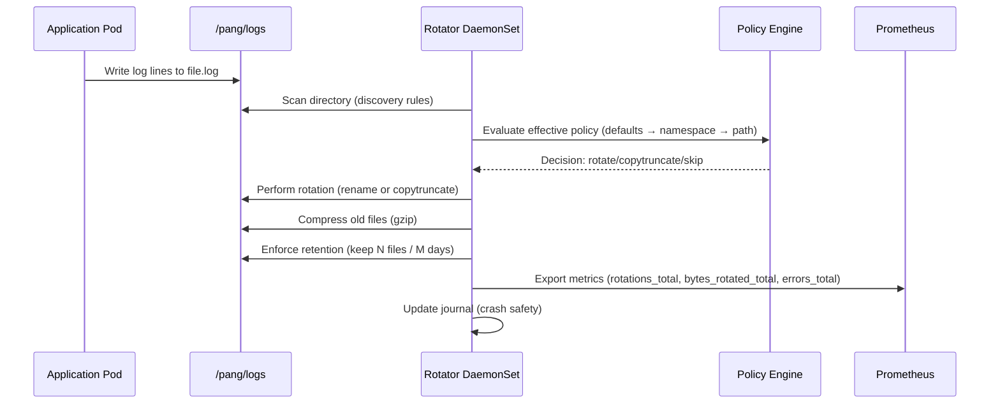

## Rotator - Namespace-Aware Log Rotation (Go + Helm)

Per-node DaemonSet rotating logs under `/pang/logs/<namespace>/<pod>/**` with defaults and overrides by namespace and path.

### Install with Helm

```bash
helm install rotator ./helm/rotator
```

### Config

See `helm/rotator/values.yaml` and the rendered ConfigMap.

### Mermaid Diagrams

```mermaid
flowchart TD
    subgraph Node
      A[Applications in Pods] -->|Write logs| B[/pang/logs/<namespace>/<pod>/*.log/]
      B --> C[Rotator DaemonSet Pod]
      C -->|Rotate + Compress| D[Rotated Files (.1, .2.gz)]
      C -->|Metrics Exporter| E[Prometheus]
      C -->|Health Endpoints| F[Liveness / Readiness Probes]
    end

    subgraph Cluster
      C --> G[Central Monitoring (Grafana/Loki)]
    end

    style A fill=#d1e8ff,stroke=#0366d6
    style B fill=#e5f5ff,stroke=#0366d6
    style C fill=#c6f6d5,stroke=#2f855a
    style D fill=#edf2f7,stroke=#4a5568
    style E fill=#fefcbf,stroke=#d69e2e
    style F fill=#fefcbf,stroke=#d69e2e
    style G fill=#fff5f5,stroke=#c53030
```



### Local end-to-end (kind)

Prereqs: kind, kubectl, helm, docker.

```bash
cd rotator
make docker                 # build rotator:dev locally
make local-kind             # create kind cluster
make local-load             # load image into kind
make local-install          # install Helm chart with local image
make local-demo             # create demo namespaces and log writers

# Observe
kubectl get pods -A -l app=rotator -o wide
kubectl -n payments logs ds/demo-log-writer -f
kubectl -n kube-system port-forward ds/rotator 9102:9102 &
curl -s localhost:9102/metrics | grep rotator_
```


